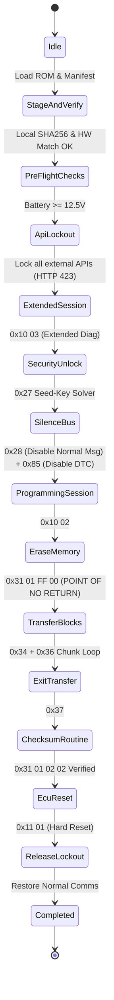

# Safe ECU Flashing & Parameter Programming Runbook

> [!CAUTION]
> Flashing an ECU carries inherent risk of rendering the vehicle non-operational.
> You must strictly adhere to the pre-flight checks and safety protocols outlined here.

---

## 1. The Pre-Flight Verification Gate

Before initiating an ECU flash sequence (`0x34 RequestDownload` / `0x31 01 FF 00 Erase`):

1. **Battery Supply Voltage**:
   - Must be measured $\ge 12.5\text{ V}$ continuously for at least 10 seconds.
   - A dedicated automotive power supply / battery maintainer (e.g., GYSflash, Deutronic) providing at least 30A must be connected.
   - Refuse flash if voltage $< 12.5\text{ V}$.
2. **Local Binary Staging**:
   - The flash image must exist on the local filesystem (`/var/run/sterngate/staging.bin` or temp directory).
   - Checksum verification (SHA256 and Bosch CRC32) must be calculated locally and validated against the manifest.
3. **Hardware / Software Compatibility**:
   - Query ECU Hardware Version (`Service 0x22 DID 0xF191`).
   - Query ECU Calibration ID (`Service 0x22 DID 0xF190`).
   - Abort immediately if the staged image's target ID does not match the ECU hardware ID.

---

## 2. Flashing Execution State Machine

---

## 3. Session Keep-Alive ($S_3$ Guard)

The flashing worker runs as a detached high-priority Tokio task (`SCHED_FIFO` or `nice -20` on Linux).
Between data blocks, it continuously guarantees:
- TesterPresent (`0x3E 80`) dispatched every $2000\text{ ms}$.
- If any frame is dropped or an unrecoverable NACK (`0x7F`) is received before erasing, the sequence aborts cleanly.
- If an error occurs *after* erasing has completed, the worker enters `RecoveryMode` and attempts re-flashing the recovery image.

---

## 4. Zero-Trust Command Integrity & Network Drop Resilience

All mutating commands (variant coding, parameter writes, routine actuation, and flash triggers) are treated as untrusted and potentially incomplete:

1. **Envelope Verification**:
   - Every request from Web UI or P2P tunnels must arrive encapsulated in a `CommandEnvelope`.
   - The core verifies exact byte length (`payload_len`) and IEEE 802.3 CRC32 (`payload_crc32`) match the raw payload.
   - Any truncated packet or network glitch immediately triggers `SterngateError::CorruptedPayload` with zero CAN transmission.
2. **Replay & Stale Command Protection**:
   - The envelope carries `timestamp_ms` and a strictly bounded `ttl_ms` (typically 3000ms).
   - If a request is delayed over high-latency cellular or reconnecting WiFi, it is rejected with `SterngateError::ExpiredCommand`.
   - `idempotency_key` guarantees commands are never executed more than once.
3. **Deterministic Local Autonomy**:
   - Once a flashing or long-running routine is validated and started, the core worker executes detached locally.
   - Loss of WebSocket connection, browser closing, or P2P QUIC disconnect NEVER interrupts the $S_3$ keep-alive or in-flight transfer blocks.

