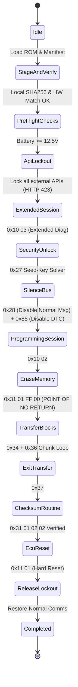

# Safe ECU Flashing & Parameter Programming Runbook

> [!CAUTION]
> Flashing an ECU carries inherent risk of rendering the vehicle non-operational.
> You must strictly adhere to the pre-flight checks and safety protocols outlined here.

---

## 1. The Pre-Flight Verification Gate

Before initiating an ECU flash sequence (`0x34 RequestDownload` / `0x31 01 FF 00 Erase`):

1. **Battery Supply Voltage**:
   - Must be measured $\ge 12.5\text{ V}$ continuously for at least 10 seconds.
   - A dedicated automotive power supply / battery maintainer (e.g., GYSflash, Deutronic) providing at least 30A must be connected.
   - Refuse flash if voltage $< 12.5\text{ V}$.
2. **Local Binary Staging**:
   - The flash image must exist on the local filesystem (`/var/run/sterngate/staging.bin` or temp directory).
   - Checksum verification (SHA256 and Bosch CRC32) must be calculated locally and validated against the manifest.
3. **Hardware / Software Compatibility**:
   - Query the ECU's system-supplier hardware number (`Service 0x22 DID 0xF192`) and compare it to the manifest's `expected_hw_id` **exactly** — trimmed, case-insensitive, both sides at least 8 characters, full string equality only. Sibling ECUs differ only in their last digits, so a partial match would accept the wrong hardware.
   - Query ECU Calibration ID (`Service 0x22 DID 0xF190`).
   - Abort immediately if the staged image's target ID does not match the ECU hardware ID. See [Phase 0b contract](#phase-0b-contract) for the full pre-flight gate list.

---

## Phase 0b contract

- Pre-flight compares the ECU's system-supplier hardware number (DID F192) with the manifest's `expected_hw_id` **exactly** (trimmed, case-insensitive, both ≥ 8 characters). A read failure, a disconnected interface or an empty manifest id fails the check. `flash_length` must equal the ROM size.
- The programming sequence holds the interface for its whole duration; every step (extended session, security access, communication/DTC control, programming session, erase, RequestDownload, each TransferData block, TransferExit, the ECU checksum routine `0x0202`, reset) aborts the flash on a negative response, a malformed reply or a timeout. The worker sends a suppressed TesterPresent whenever 1.5 s pass without an exchange and waits P2\* (+500 ms) while the ECU reports ResponsePending.
- RequestDownload is built from the manifest's `flash_start_address`/`flash_length`; the block size is the minimum of the manifest's `block_size`, the ECU's `maxNumberOfBlockLength − 2` and 4093. Every TransferData reply must echo the block counter.
- On failure the state is `FAILED` (not locked) and `error_message` starts with either `Flash aborted before erase; ECU untouched.` or `FLASH FAILED AFTER ERASE - ECU is in bootloader with incomplete application. Keep ignition ON, do not disconnect.` A verified image whose ECU does not acknowledge the reset ends `COMPLETED` with the warning `ECU did not acknowledge reset; cycle ignition manually`.
- The ECU checksum routine id `0x0202` and its OK status `0x00` are project constants not yet verified against real EDC16 firmware; a real ECU that reports success differently will fail the flash after the write (fail-closed).
- Vault entries carry `stageable`; `.cff`/`.smr-f` files and anything that sniffs as a Caesar container are never stageable and `POST /api/v1/vault/stage` returns 400 for them. Obtain a raw image via `sterngate corpus extract` (Phase 1).
- `POST /api/v1/flash/stage` requires `rom_base64`; a missing field or undecodable base64 is `400` and the server never substitutes firmware bytes. The manifest is verified against the ROM and never rewritten from it: `crc32_checksum`, `sha256_checksum` (hex, case-insensitive) and `flash_length` must all match the decoded image, otherwise `400` naming the field that disagrees. Order is decode → container sniff → checksum verification, so a container still returns the container message. Pre-flight re-verifies the same three values.
- `POST /api/v1/vault/stage` takes `expected_hw_id` from the image's own Bosch hardware number. A binary with no such number is refused with `400` ("no Bosch hardware number found in the image; identity cannot be verified") before anything is spawned — no stand-in id is ever invented. `expected_sw_id` is informational and reads `UNKNOWN` when absent. `flash_start_address` (0x00040000) and `block_size` (4096) are still defaults; the 200 body repeats them under `assumed` so the operator can see what was not read from the image (a sidecar manifest is Phase 1).
- A single UDS exchange tolerates at most `P2_STAR_MAX_PENDING = 20` consecutive NRC 0x78 (ResponsePending) replies; the 21st fails the request with `IsoTpTimeout`. Without the cap an ECU that answers ResponsePending forever would hold the interface lock and the `HTTP 423` lockout until the process is killed. This caps one request only — there is deliberately **no** overall sequence deadline, because a legitimate flash runs for minutes and aborting mid-write is worse than waiting.
- A single exchange stretched past 2 s by ResponsePending needs no TesterPresent of its own: the ECU's own `7F <sid> 78` restarts the S3 timer, so the keep-alive only has to cover gaps *between* exchanges. During a long STmin burst the sender emits only Consecutive Frames (no request completes, and none may be interleaved), which is likewise not an idle gap.
- Voltage: the server and CLI read `VehicleInterface::measure_battery_voltage` themselves. When the adapter measures, that value gates the flash and a client-supplied `measured_voltage` that differs by more than 1.0 V is refused; when the adapter cannot measure (SocketCAN, mock), the client value is required. `sterngate flash start` refuses on adapters that cannot measure; `flash preflight --voltage` is a dry-run override only.

---

## 2. Flashing Execution State Machine



---

## 3. Session Keep-Alive ($S_3$ Guard)

The flashing worker runs as a detached high-priority Tokio task (`SCHED_FIFO` or `nice -20` on Linux).
Between data blocks, it continuously guarantees:
- A suppressed TesterPresent (`0x3E 80`) is dispatched whenever $1500\text{ ms}$ pass without an exchange (`S3KeepAlive`, `S3_KEEPALIVE_INTERVAL`); see [Phase 0b contract](#phase-0b-contract).
- Every step of the sequence aborts the flash cleanly on a negative response, a malformed reply, or a timeout, before erasing.
- If an error occurs *after* erasing has completed, the state is `FAILED` (not locked) with the fail-closed `FLASH FAILED AFTER ERASE` warning — see [Phase 0b contract](#phase-0b-contract) for the exact messages. There is no automatic `RecoveryMode` re-flash; recovery is a manual, deliberate re-flash of a verified image.

---

## 4. Zero-Trust Command Integrity & Network Drop Resilience

All mutating commands (variant coding, parameter writes, routine actuation, and flash triggers) are treated as untrusted and potentially incomplete:

1. **Envelope Verification**:
   - Every request from Web UI or P2P tunnels must arrive encapsulated in a `CommandEnvelope`.
   - The core verifies exact byte length (`payload_len`) and IEEE 802.3 CRC32 (`payload_crc32`) match the raw payload.
   - Any truncated packet or network glitch immediately triggers `SterngateError::CorruptedPayload` with zero CAN transmission.
2. **Replay & Stale Command Protection**:
   - The envelope carries `timestamp_ms` and a strictly bounded `ttl_ms` (typically 3000ms).
   - If a request is delayed over high-latency cellular or reconnecting WiFi, it is rejected with `SterngateError::ExpiredCommand`.
   - `idempotency_key` guarantees commands are never executed more than once.
3. **Deterministic Local Autonomy**:
   - Once a flashing or long-running routine is validated and started, the core worker executes detached locally.
   - Loss of WebSocket connection, browser closing, or P2P QUIC disconnect NEVER interrupts the $S_3$ keep-alive or in-flight transfer blocks.

---

## 5. CLI Flashing Suite Commands

Sterngate provides direct terminal commands with built-in safety interlocks:

```bash
# 1. Stage and cryptographically verify firmware ROM
sterngate flash stage --module EDC16 --file /path/to/stage1.bin \
  --hw-id 0281012234 --sw-id 1037372120 --start-address 0x00040000

# 2. Run pre-flight safety checks (voltage >= 12.5V, HW ID match, CRC32/SHA256)
sterngate flash preflight --manifest /var/run/sterngate/flash_manifest.json

# 3. Start detached flash sequence (requires interactive confirmation or --yes)
sterngate flash start --manifest /var/run/sterngate/flash_manifest.json --yes

# 4. Monitor live progress of detached flashing worker
sterngate flash status
```

---

## 6. Local Firmware Vault & Calibration Upgrade Scanner

Sterngate keeps all firmware binaries strictly decoupled from remote networks and Git repositories:
1. **Local Vault Scanning**:
   - `GET /api/v1/vault/scan?path=<PATH>&hw_id=<HW>&sw_id=<SW>` scans the local firmware vault for `.bin`, `.rom`, `.cff`, `.smr-f`, and `.fls` files. `<PATH>` is interpreted **inside the configured vault root** (blank scans the whole vault).
   - The vault root is resolved once, in precedence order: `--vault <DIR>`, then `STERNGATE_VAULT_ROOT`, then `./firmware_vault`. Both vault routes are confined to it, so `../`, absolute paths, and symlinks that escape the root are rejected with `400`.
   - Extracts Bosch HW/SW IDs, OEM part numbers, and SHA256 hashes directly from raw binary headers.
   - Every entry carries `stageable`. `.cff`/`.smr-f` files and anything that sniffs as a Caesar flash container are listed for visibility but always come back `stageable: false`; they can never be staged directly. Obtain a raw image via `sterngate corpus extract` (Phase 1).
2. **Auto-Matched Upgrade Recommendation**:
   - If a discovered binary matches the connected vehicle ECU hardware ID (`DID 0xF192`) but contains a newer calibration version (`DID 0xF194`), Sterngate generates a verified upgrade recommendation.
3. **One-Click Staging**:
   - `POST /api/v1/vault/stage` takes `file_path` and an optional `measured_voltage`, verifies the safety interlocks, computes CRC32/SHA256, and stages the firmware for flashing without streaming bytes over the network. It also returns `400` for a file that is a Caesar flash container, same as `POST /api/v1/flash/stage`.
   - See [Phase 0b contract](#phase-0b-contract) below for how `measured_voltage` is now resolved; it is no longer unconditionally mandatory.
   - `sterngate mod apply` and `POST /api/v1/mods/apply` follow the same voltage resolution rule as the staging routes: the CLI reads the OpenPort Pin-16 ADC through `VehicleInterface::measure_battery_voltage` and refuses on adapters without a sensor; the REST route resolves the voltage the same way (`resolve_flash_voltage`), so `battery_voltage` is a cross-check when the adapter can measure — refused if it disagrees by more than 1.0 V — and is required only when the adapter cannot measure. The connected VIN is always required.


